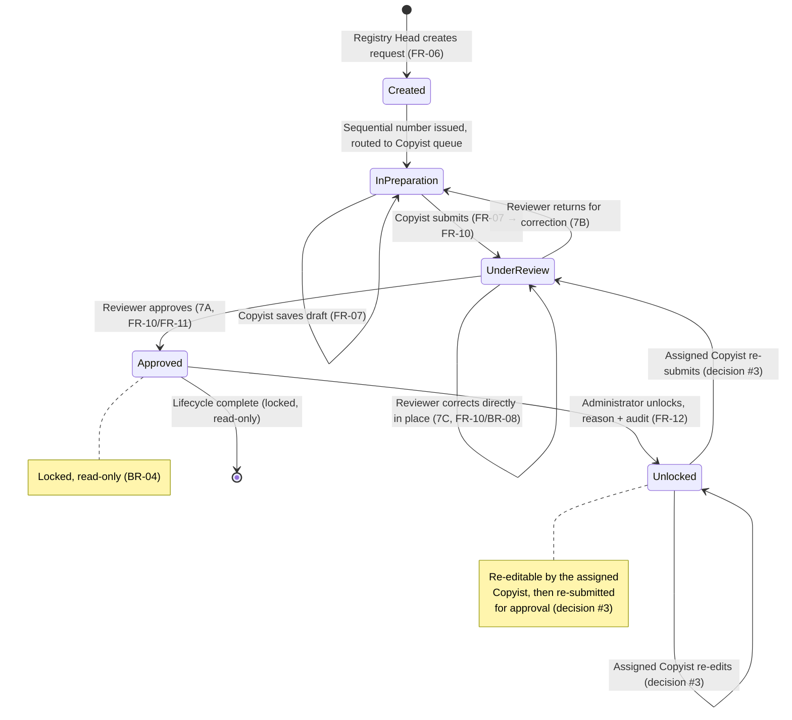
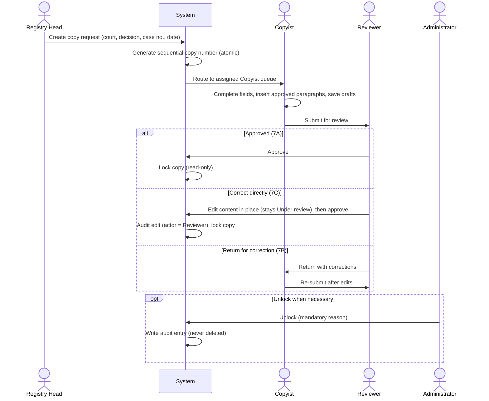

# JCS — Workflow & State Diagram

Companion to `PRD.md`. Describes the copy request lifecycle, the actors involved at each
transition, and the points the PRD leaves undefined.

> Transitions marked **[OPEN]** are not yet specified in the PRD. They are labeled `[OPEN]`
> in the diagram and must be confirmed with stakeholders before the workflow engine is built.
> Any target state shown for an [OPEN] transition is tentative, not a decision.

---

## 1. State machine

### States

| State | Meaning | Who can act |
|-------|---------|-------------|
| Created | Request exists, copy number issued | System (routes to Copyist) |
| In preparation | Copyist drafting content | Assigned Copyist (BR-02) |
| Under review | Submitted, awaiting review | Reviewer (BR-03): approve, correct directly (BR-08), or return |
| Approved | Finalized and locked, read-only | No one (BR-04) |
| Unlocked | Admin reopened an approved copy | Assigned Copyist re-edits, then re-submits (decision #3) |

### Transitions

- **متفرق creation (BR-11):** a متفرق decision is created from an **Approved عادي copy** (the original):
  it gets **no رقم النسخة**, only a **رقم المتفرق**, links to the original, and inherits its
  court/room/رقم الأساس. It then follows the same lifecycle (Copyist prepares → Reviewer approves).
- **Acceptance (FR-07, BR-13):** the assigned Copyist must **accept (قبول)** a copy before editing or
  submitting it (no content write before acceptance). Acceptance follows a **strict order**: by priority
  tier (موقوف > مستعجل > عادي), then **oldest-first** within a tier — a Copyist can't accept a copy while
  one of theirs ranks before it. The acceptance time is recorded (`AcceptedUtc`) and accepted rows are
  colour-highlighted. The detail page shows a **per-stage timeline** (time spent in each stage) from the audit trail.
- **Escalate to مستعجل (FR-06, BR-13):** the Registry Head may set a **non-approved** copy's status to
  مستعجل at any time (expedite number required), raising its work-queue priority. Audited as `expedite`.
- **Post-unlock (decision #3, RESOLVED):** the assigned Copyist re-edits the Unlocked copy and
  re-submits it to the Reviewer for approval (Unlocked → Under review → Approved). The copy keeps
  its number.
- **Direct correction (7C, BR-08):** the Reviewer edits the content in place while it stays
  `Under review` (no state change), then approves. The edit is audited as `edit` with the Reviewer
  as actor. This is the only content-write exception to BR-02.
- **Return for correction (7B):** returns to `In preparation` for the assigned Copyist. **[OPEN]**
  whether review/return (and unlock/re-review) cycles are capped — decision #2.
- **Delete (decision #5, RESOLVED):** via the deletion window (FR-16, BR-09/BR-11), a Registry Head may
  delete within their courts: the **latest عادي copy per court** (rolls back رقم النسخة; blocked if it has
  **linked متفرق**), or the **last متفرق per numbering scope** (rolls back رقم المتفرق). Hard delete of
  copy + content; no gap; audit retained. No other cancel/void path.

## 2. Actor sequence (happy path)

## 3. Authorization gates

Every transition is re-checked server-side against role, permissions, and court assignment.

| Transition | Gate |
|------------|------|
| Create request | Role = Registry Head (BR-01) |
| Edit / save draft | Role = Copyist **and** assigned to this copy (BR-02) |
| Submit for review | Assigned Copyist |
| Approve / return | Role = Reviewer (BR-03) |
| Correct directly (edit in place) | Role = Reviewer, copy Under review (BR-08) |
| Delete latest عادي / last متفرق | Role = Registry Head; via deletion window; عادي = court+year latest & no linked متفرق; متفرق = last in its scope (BR-09/BR-11, FR-16) |
| Unlock | Role = Administrator (BR-05) |
| Any court-scoped action | User assigned to the court (BR-06) |

## 4. Audited transitions

These actions write an append-only audit entry (actor, timestamp, before/after where
content changes). Audit history is never deleted.

`create` · `accept` · `edit` · `submit` · `return` · `approve` · `unlock` · `delete` · `expedite`

**Delete (FR-16):** performed via a dedicated deletion window, in two sections (current year, the head's
courts): the **latest عادي copy per court** (rolls back **رقم النسخة**; disabled when it has **linked
متفرق** — they would be orphaned), and the **last متفرق per numbering scope** (rolls back **رقم المتفرق**;
a متفرق has no رقم النسخة). The copy + content rows are removed (any state, incl. Approved); a `delete`
audit entry is appended and **all audit history is retained**; the next copy reuses the freed number,
**no gap**.
